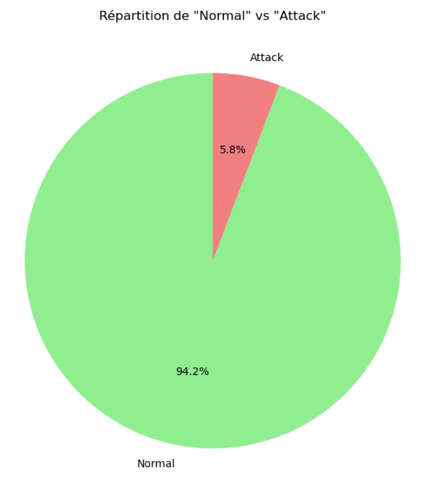
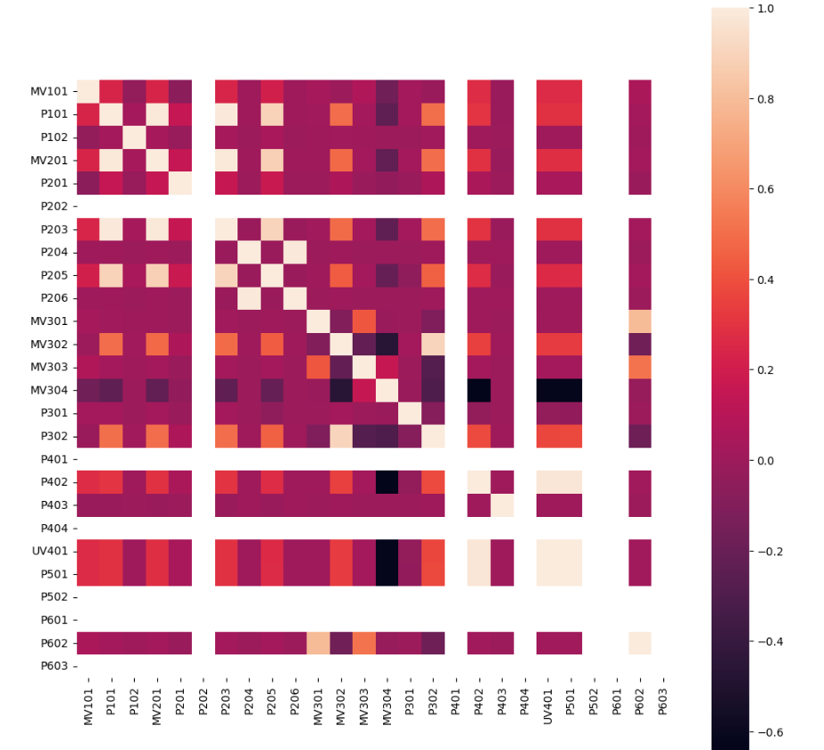

.. _1model:

=====
Développement des models : Datasets
=====

Description
===========

Dans cette section nous allons voir comment développer un modèle de détection d'anomalies pour le protocole Modbus TCP.
Les travaux sur les modèles développés sont inspirés les travaux suivants : IDS_UNSW-NB15 (https://github.com/SubrataMaji/IDS-UNSW-NB15/tree/master).
Les datasets utilisés pour le Modbus TCP viennent des travaux suivants :  https://github.com/elisejiuqizhang/USAD-on-WADI-and-SWaT .

Les datasets SWAT ont été utilisés pour la suite de ce travail: 
 - dataset normal : https://drive.google.com/file/d/1rVJ5ry5GG-ZZi5yI4x9lICB8VhErXwCw/view
 - dataset attack : https://drive.google.com/open?id=1iDYc0OEmidN712fquOBRFjln90SbpaE7

Nettoyage et analyse des données
================================

Lecture et visualisation des données :
--------------------------------------

Pour l'analyse des données, nous avons utilisé les librairies suivantes :
- pandas
- numpy
- matplotlib

Nous allons voir premièrement comment sont structurées les données : 

.. code-block:: python

        normal = pd.read_csv("../data/SWaT_Dataset_Normal_v1.csv",sep = ",",low_memory=False)    
        attack = pd.read_csv("../data/SWaT_Dataset_Attack_v0.csv",low_memory=False, sep=";")        
        
        normal = normal.drop(["Timestamp"] , axis = 1)
        attack = attack.drop(["Timestamp"] , axis = 1)      
        
        normal.head()
        attack.head()

Nous avons supprimé la colonne Timestamp car elle n'est pas utile pour la suite de notre travail.
Avec la fonction `head()` nous pouvons voir les premières lignes des données:

.. code-block:: python 

    FIT101	LIT101	MV101	P101	P102	AIT201	AIT202	AIT203	FIT201	MV201	...	P501	P502	PIT501	PIT502	PIT503	FIT601	P601	P602	P603	Normal/Attack

Pour avoir la liste liste des colonnes présentes dans les données, nous utilisons la fonction `columns` de pandas: 

.. code-block:: python
        
        normal.columns

        Index(['FIT101', 'LIT101', 'MV101', 'P101', 'P102', 'AIT201', 'AIT202',
       'AIT203', 'FIT201', 'MV201', 'P201', 'P202', 'P203', 'P204', 'P205',
       'P206', 'DPIT301', 'FIT301', 'LIT301', 'MV301', 'MV302', 'MV303',
       'MV304', 'P301', 'P302', 'AIT401', 'AIT402', 'FIT401', 'LIT401', 'P401',
       'P402', 'P403', 'P404', 'UV401', 'AIT501', 'AIT502', 'AIT503', 'AIT504',
       'FIT501', 'FIT502', 'FIT503', 'FIT504', 'P501', 'P502', 'PIT501',
       'PIT502', 'PIT503', 'FIT601', 'P601', 'P602', 'P603', 'Normal/Attack'],
      dtype='object')

On peut aussi voir les types de données de chaque colonne avec la fonction `info()` :

.. code-block:: python

        normal.info()

        <class 'pandas.core.frame.DataFrame'>
        RangeIndex: 495000 entries, 0 to 494999
        Data columns (total 52 columns):
         #   Column         Non-Null Count   Dtype 
        ---  ------         --------------   ----- 
         0   FIT101         495000 non-null  object
         1   LIT101         495000 non-null  object
         2   MV101          495000 non-null  int64 
         3   P101           495000 non-null  int64 
         4   P102           495000 non-null  int64 
         5   AIT201         495000 non-null  object
         6   AIT202         495000 non-null  object
         7   AIT203         495000 non-null  object
         8   FIT201         495000 non-null  object
         9   MV201          495000 non-null  int64 
         10  P201           495000 non-null  int64 
         11  P202           495000 non-null  int64 
         12  P203           495000 non-null  int64 
         13  P204           495000 non-null  int64 
         14  P205           495000 non-null  int64 
         15  P206           495000 non-null  int64 
         16  DPIT301        495000 non-null  object
         17  FIT301         495000 non-null  object
         18  LIT301         495000 non-null  object
         19  MV301          495000 non-null  int64 
         20  MV302          495000 non-null  int64 
         21  MV303          495000 non-null  int64 
         22  MV304          495000 non-null  int64 
         23  P301           495000 non-null  int64 
         24  P302           495000 non-null  int64 
         25  AIT401         495000 non-null  object
         26  AIT402         495000 non-null  object
         27  FIT401         495000 non-null  object
         28  LIT401         495000 non-null  object
         29  P401           495000 non-null  int64 
         30  P402           495000 non-null  int64 
         31  P403           495000 non-null  int64 
         32  P404           495000 non-null  int64 
         33  UV401          495000 non-null  int64 
         34  AIT501         495000 non-null  object
         35  AIT502         495000 non-null  object
         36  AIT503         495000 non-null  object
         37  AIT504         495000 non-null  object
         38  FIT501         495000 non-null  object
         39  FIT502         495000 non-null  object
         40  FIT503         495000 non-null  object
         41  FIT504         495000 non-null  object
         42  P501           495000 non-null  int64 
         43  P502           495000 non-null  int64 
         44  PIT501         495000 non-null  object
         45  PIT502         495000 non-null  object
         46  PIT503         495000 non-null  object
         47  FIT601         495000 non-null  object
         48  P601           495000 non-null  int64 
         49  P602           495000 non-null  int64 
         50  P603           495000 non-null  int64 
         51  Normal/Attack  495000 non-null  object
        dtypes: int64(26), object(26)
        memory usage: 196.4+ MB

On peut aussi voir la tailles des données avec la fonction `shape` :

.. code-block:: python

        normal.shape

        (495000, 52)

        attack.shape

        (449919, 52)

Combinaison des données :
-------------------------

Nous allons combiner les données normal et attack pour avoir un seul dataset.
Pour cela, on va vérifier si les colonnes sont les mêmes dans les deux datasets: 

.. code-block:: python

    if set(normal.columns) == set(attack.columns):
        print("On a les mêmes colonnes sur les deux fichiers.")
    else:
        print("On n'a pas les mêmes colonnes !!")
        print("_________normal__________")
        print(normal.columns)
        print("_________attack__________")
        print(attack.columns)

Une fois cette vérification validée, on peut combiner les deux datasets:

.. code-block:: python

    if normal.columns.equals(attack.columns):
        combined = pd.concat([normal, attack], ignore_index=True)
        print("Les DataFrames ont été combinés avec succès !")
    else:
        print("Les colonnes des deux DataFrames ne sont pas identiques.")

On peut aussi valider que les deux datasets ont les mêmes colonnes avec la fonction `equals` de pandas.
On peut vérifier en suite la taille du dataset combiné avec la fonction `shape` et ses colonnes avec la fonction `columns`.

Correction et ajustement : 
--------------------------

Avec le code suivant, on a pu voir les différentes valeurs dans la colonnes `Normal/Attack`:

.. code-block:: python
    
    count_values = combined['Normal/Attack'].value_counts()
    count_values

    Normal     890298
    Attack      54584
    A ttack        37
    Name: Normal/Attack, dtype: int64

On va ensuite corriger les valeurs `A ttack` en `Attack`:

.. code-block:: python

    combined['Normal/Attack'] = combined['Normal/Attack'].replace({'A ttack': 'Attack'})
    count_values = combined['Normal/Attack'].value_counts()
    count_values

    Normal    890298
    Attack     54621
    Name: Normal/Attack, dtype: int64

On va aussi convertir les valeurs des colonnes en `float`:

.. code-block:: python

    # correction de 2,427377(object) => 2.427377(float) 
    # Remplacer les virgules par des points dans toutes les colonnes de type 'object'
    combined = combined.apply(lambda col: col.str.replace(',', '.') if col.dtype == 'object' else col)
    combined = combined.astype(float)
    #Vérification 
    combined.info()

    class 'pandas.core.frame.DataFrame'
    RangeIndex: 944919 entries, 0 to 944918
    Data columns (total 47 columns):
     #   Column         Non-Null Count   Dtype  
     
     0   FIT101         944919 non-null  float64
     1   LIT101         944919 non-null  float64
     2   MV101          944919 non-null  float64
     3   P101           944919 non-null  float64
     4   P102           944919 non-null  float64
     5   AIT201         944919 non-null  float64
     6   AIT202         944919 non-null  float64
     7   AIT203         944919 non-null  float64
     8   FIT201         944919 non-null  float64
     9   P201           944919 non-null  float64
     ...
     44  P602           944919 non-null  float64
     45  P603           944919 non-null  float64
     46  Normal/Attack  944919 non-null  float64
        dtypes: float64(47)
        memory usage: 338.8 MB
Cette étape a été réaliser à la fin des analyses de données.

Analyse :
---------

Nous avons vu que les données `normal` sont de 890298 et les données `attack` sont de 54621.
On peut une représentation graphique de ces données avec la fonction `plot`:

.. code-block:: python

    plt.figure(figsize=(8, 8))
    plt.pie(count_values, labels=count_values.index, autopct='%1.1f%%', colors=['lightgreen', 'lightcoral'], startangle=90)
    plt.title('Répartition de "Normal" vs "Attack"')
    plt.show()

    Répartition de "Normal" vs "Attack"

Nous allons en suite voir la correlation entre les différentes colonnes avec la fonction `corr`:

.. code-block:: python

    corr_matrix = combined.corr(method= "pearson")
    plt.figure(figsize=(12, 12))  
    sns.heatmap(corr_matrix,square=True)
    plt.show()

    
    Matrice de corrélation

Dans la suite de l'entrainnement des modèles, on va supprimer les colonnes qui ont une corrélation élevée avec d'autres colonnes.
Nous allons voir les colonnes aves les corrélations les plus élevées : 

.. code-block:: python

    limit = 0.9

    columns = corr_matrix.columns
    for i in range(corr_matrix.shape[0]):
        for j in range(i+1, corr_matrix.shape[0]):
            if corr_matrix.iloc[i, j] >= 0.9:
                print(f"{columns[i]:20s} {columns[j]:20s} {corr_matrix.iloc[i, j]}")

    P101                 MV201                0.9867743963170607
    P101                 P203                 0.9917319053102396
    MV201                P203                 0.9812199691686654
    P204                 P206                 0.991030684534372
    MV302                P302                 0.9003637381665688
    P402                 UV401                0.9800483158602863
    P402                 P501                 0.9789810432214828
    UV401                P501                 0.9987942181205025

Nous allons en suite retrouver les colonnes à supprimer et les supprimer:

.. code-block:: python

    corr_matrix = combined.corr().abs()
    upper = corr_matrix.where(np.triu(np.ones(corr_matrix.shape), k=1).astype(bool))

    to_drop = [column for column in upper.columns if any(upper[column] > 0.95)]
    print(to_drop)

    >>['MV201', 'P203', 'P206', 'UV401', 'P501']

    # suppression des colonnes
    combined = combined.drop(["MV201", "P203", "P206", "UV401", "P501" ] , axis = 1)

Quand on a fini toutes nos analyse et modification, on va maintenant remplacer les labels `Normal` et `Attack` par `0` et `1` respectivement:

.. code-block:: python
    
    combined['Normal/Attack'] = combined['Normal/Attack'].replace({'Normal': 0, 'Attack': 1})

Séparation des données :
-------------------------

On va séparer les données en données d'entrainement et données de test. 
Premièrement on va séparer les labels `0` et `1`:

.. code-block:: python

    normal_data = combined[combined['Normal/Attack'] == 0]
    attack_data = combined[combined['Normal/Attack'] == 1]

On a pu remarquer qu'on a beaucoup plus de données `Normal` que de données `Attack`.
On va donc prendre un échantillon des données `Normal` pour avoir un nombre équivalent de données `Normal` et `Attack`:

.. code-block:: python

    normal_data = normal_data.sample(n=54584, random_state=42)

On va en suite séparer les données de test(20%) et d'entrainement(80%): 

.. code-block:: python

    # Concaténer les données normal et attack
    balanced_data = pd.concat([normal_data, attack_data])
    # Séparer le jeu de données en train et test (80% train, 20% test)
    train_data, test_data = train_test_split(balanced_data, test_size=0.2, stratify=balanced_data['Normal/Attack'], random_state=42)    

On peut en suite les sauvegarder dans des fichiers csv pour les utiliser dans la suite de l'entrainement des modèles:

.. code-block:: python

    train_data.to_csv("../data/train_data.csv",sep=';', index=False)
    test_data.to_csv("../data/test_data.csv",sep=';', index=False)

Nous pouvons maintenant passer à l'entrainement des modèles.

